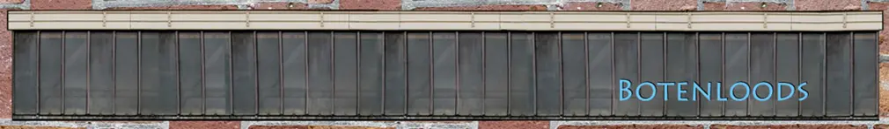
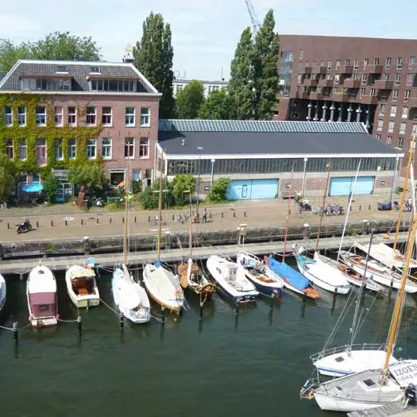

# Winc Academy - Part-time Job

---

## Technologies & Frameworks

- Wordpress 
- HTML 
- (S)CSS 
- PHP 

---

## Summary

As a part-time job and service to my neighbouring shipyard I took management over their website which was at the time of 
accusation not working correctly. Stylesheets wouldn't load, images were missing, the website was insecure, out of date
content had to be updated or removed and new content had to be made available. The administrator of the website at the 
time was too old to manage the website further, so I took responsibility over the previously mentioned aspects.

Also, management of the multiple email addresses that are in use, the website & email hosting (party) and subdomains had
to be reconfigured to work correctly. Now, I occasionally upload new content to the website using the WordPress content
management system or update existing content.

---

## Check out the website

[<button> de Botenloods</button>](https://www.botenloods.nl/)

---
