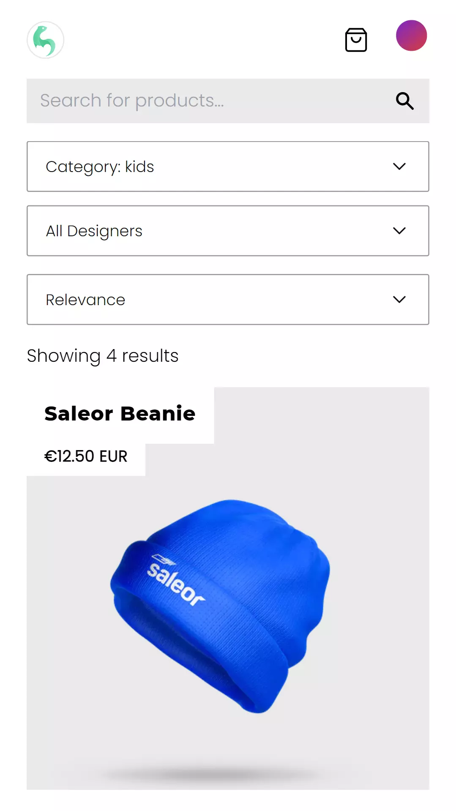
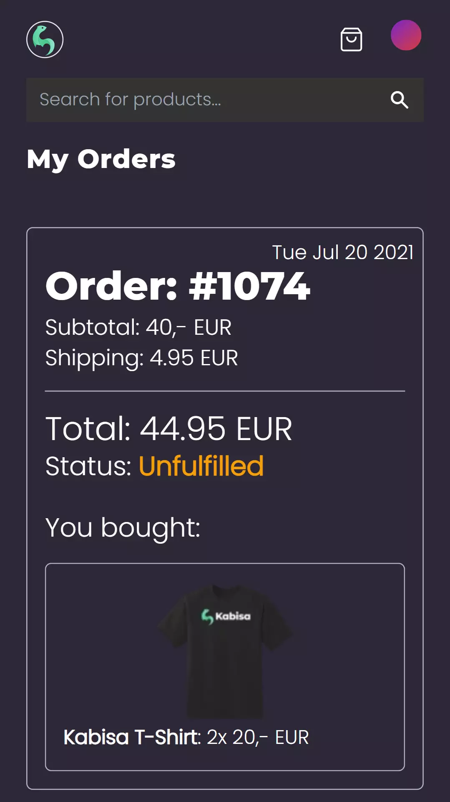
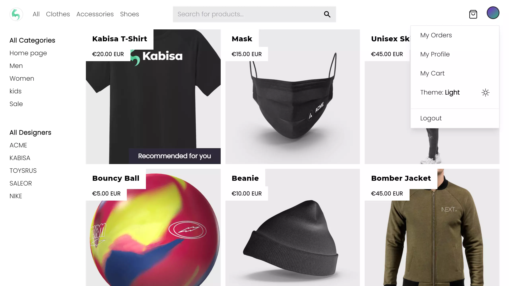

# Kabisa - Graduation Internship


---

## Technologies & Frameworks

- Next.js (Commerce) Framework [](https://nextjs.org/commerce)
- React.js web framework [](https://reactjs.org/)
- Shopify [](https://shopify.com/)
- TypeScript [](https://www.typescriptlang.org/)
- GraphQL [](https://www.graphql.org/)
- TailwindCSS [](https://tailwindcss.com/)
- Vercel deployment platform [](https://vercel.com/)
- Progressive Web Application [](https://web.dev/progressive-web-apps/)

---

## Summary

For my graduation assignment for my Software Engineering study at the University of Applied Sciences in Amsterdam I did
an internship at the Kabisa B.V. company. During the internship I worked on a singular research and development assignment.
The graduation assignment was about headless architecture in the context of e-commerce applications. For the assignment I
performed research about what headless architectures are, how they compare to traditional (monolithic) architectures and
when which solution is applicable when it comes to an e-commerce system.

Based on the initial research I gathered technical and client oriented requirements from within the Kabisa organisation for
such an e-commerce system. Based on the collected requirements I compared potential headless e-commerce platforms and compatible
front-end web frameworks to build headless e-commerce systems with. Based on the research results, the requirements from
within the organisation and further knowledge of the market of the product owner a definitive combination of headless e-commerce
platform and compatible front-end web framework was chosen to realize the proof of concept with.

During the development phase of the proof of concept I adhered to an Agile Scrum methodology and worked on the product in
4 sprints of 2 weeks during which I performed all development and scrum tasks like sprint plannings, demo's, retrospectives
completing user stories, writing tests and making the project available via internet for demonstration purposes using CI/CD.

The proof of concept product turned out to be a blazing fast e-commerce website using the most modern web-development 
techniques and technologies among which are Next.js, GraphQL, PWA and more!

---

## Screens




<video autoplay muted loop playsinline controls src="../projects/kabisa/kabisa.webm"></video>

---

## Techniques & Libraries

- [NodeJS](https://nodejs.org/)
- [JSON](https://json.org/)
- [GraphQL](https://graphql.org/)
- [Yarn](https://yarnpkg.com/)
- [Jest Unit testing](https://jestjs.io/)
- [Cypress E2E testing](https://www.cypress.io/)
- [ESLint](https://www.eslint.org/)
- [Github Actions](https://www.github.com/features/actions)
- [Lighthouse Audits](https://developers.google.com/web/tools/lighthouse/)

---

<details>
  <summary>Code Snippets</summary>
<div>

The following are some code snippets of pieces of code I'm proud of from this project. The snippets demonstrate clean, consice and powerful code. _(Code has been compacted)_

**My Orders page**\
The My Orders page is responsible for displaying all past orders to any logged-in user. The past orders are retrieved using
client-side rendering and the page feature s infinite scrolling.

```
export default function Orders(): JSX.Element {
  const [cursor, setCursor]     = useState<string | null>(null);
  const [orders, setOrders]     = useState<OrderEdge[]>([])
  const [atBottom, setAtBottom] = useState<boolean>(false)
  const [hasLoaded, setHasLoaded] = useState<boolean>(false)
  const router = useRouter()

  const { data, isLoading } = useCustomerOrders({ numberOfOrders: 10, cursor } )

  useEffect(() => { // When scrolled to bottom, if there are more items available, load them by setting new cursor
    if (atBottom) {
      if (orders.length && data?.orders.pageInfo.hasNextPage) {
        void router.push({ pathname: router.pathname }, undefined, { shallow: true }) // Trigger loader
        setCursor(orders[orders.length - 1].cursor)
      }
    }
    setAtBottom(false)
  }, [atBottom, data?.orders.pageInfo.hasNextPage, orders, orders.length, router])

  useEffect(() => { // Append new orders to previous orders
    if (!data?.orders.edges) return;
    setHasLoaded(true)
    setOrders(prevOrders => [...prevOrders, ...data.orders.edges])
  }, [data?.orders.edges])

  useEffect(() => { // Scroll eventListener for when at bottom of list
    const footer = document.getElementsByTagName('footer')[0]

    const scrollListener = throttle(function () {
      if ((window.innerHeight + window.scrollY) >= (document.body.offsetHeight - footer.offsetHeight)) {
        setAtBottom(true);
      } }, 500);

    window.addEventListener('scroll', scrollListener)

    return function cleanup() {
      window.removeEventListener('scroll', scrollListener)
    }
  }, [])

  return (
    <Container>
      <Text variant="pageHeading">My Orders</Text>
      <div className="flex-1 pt-4 lg:px-24 sm:px-12 flex flex-col flex-wrap 2xl:flex-row justify-center md:items-start gap-4 items-center">
        {!isLoading || hasLoaded ? <>
        {orders.length ? orders.map((order) => (
            <OrderCard key={order.node.id} order={order}/>
          ))
          :
          <div className="flex-1 px-4 py-24 sm:p-24 self-center flex flex-col justify-center items-center ">
          <span
            className="border border-dashed border-secondary rounded-full flex items-center justify-center w-16 h-16 p-12 bg-primary text-primary">
          <Bag className="absolute"/>
          </span>
            <h2 className="pt-6 text-2xl font-bold tracking-wide text-center">
              No orders found
            </h2>
            <p className="text-accent-6 px-10 text-center pt-2">
              Biscuit oat cake wafer icing ice cream tiramisu pudding cupcake.
            </p>
          </div>
        }
          </>
          : loadingPlaceholder }
      </div>
    </Container>
  )
}
```

**OrderCard component**\
This code snippet demonstrates the OrderCard component which is displayed as each individual past order of a logged in user.
The component takes a single Order object as property to present in the DOM towards the user.

```
const OrderCard: FC<Props> = ({order}) => {

  const handleScroll = (event: React.UIEvent<HTMLElement>) => {
    const target = event.target as HTMLElement
    const scrolledToBottom = target.scrollTop === (target.scrollHeight - target.offsetHeight)
    const scrolledToTop = target.scrollTop === 0

    scrolledToBottom ? target.classList.add(s.atBottom) : target.classList.remove(s.atBottom)
    scrolledToTop ? target.classList.add(s.atTop) : target.classList.remove(s.atTop)
  };

  return (
  <div className={s.orderCard}>
    <h1 className={s.orderName}>Order: {order.node.name}</h1>
    <p className={s.orderSubTotal}>Subtotal: {displayAmount(order.node.subtotalPriceV2?.amount)} {order.node.subtotalPriceV2?.currencyCode}</p>
    <p className={s.orderShipping}>Shipping: { order.node.totalShippingPriceV2.amount !== "0.0" ? ( `${displayAmount(order.node.totalShippingPriceV2.amount)} ${order.node.totalShippingPriceV2.currencyCode}` ) : <span className={s.freeShipping}>Free</span> }</p>
    <hr className={s.ruler}/>
    <p className={s.orderTotal}>Total: {displayAmount(order.node.totalPriceV2.amount)} {order.node.totalPriceV2.currencyCode}</p>
    <p className={s.orderStatus}>Status: <span
      className={order.node.fulfillmentStatus.toLowerCase() == 'fulfilled' ? s.fulfilled : ''}>{capitalize(order.node.fulfillmentStatus)}</span>
    </p>
    <p className={s.orderDate}>{new Date(Date.parse(order.node.processedAt)).toDateString()}</p>
    <br/>
    <p className={s.orderProducts}>You bought:</p>
    <div className={`${s.orderItems} ${s.atTop} ${order.node.lineItems.edges.length < 4 ? s.atBottom : ''}`} onScroll={handleScroll}>
      <section className={s.fadein}/>
      {order.node.lineItems.edges && order.node.lineItems.edges.map((product) => (
        <div className={s.orderItem} key={product.node.variant?.id}>
          <a href={`/product/${product.node.variant?.product.handle || ''}`}>
            
            <span className={s.variant}>{product.node.variant?.product.title}</span>
          </a>
          <span className={s.amount}>: {product.node.quantity}x {displayAmount(product.node.variant?.priceV2.amount)} {product.node.variant?.priceV2.currencyCode}</span>
        </div>
      ))}
      <section className={s.fadeout}/>
    </div>
  </div>
  )
}
```

**Homepage component**\
This code snippet demonstrates static site generation with Next.js using the getStaticProps method. Also incremental
static site generation is demonstrated using the revalidate property. Products, pages, categories and brands are retrieved
from the shopify back-end system and then the page is statically generated.

```
export async function getStaticProps({
  preview,
  locale,
  locales,
}: GetStaticPropsContext) {
  const config = { locale, locales }

  const productsPromise = commerce.getAllProducts({
    variables: { first: 12, sortKey: 'UPDATED_AT', reverse: true },
    config,
    preview,
  })

  const pagesPromise = commerce.getAllPages({ config, preview })
  const siteInfoPromise = commerce.getSiteInfo({ config, preview })
  const { products } = await productsPromise
  const { pages } = await pagesPromise
  const { categories, brands } = await siteInfoPromise

  return {
    props: {
      products,
      categories,
      brands,
      pages,
      locale,
    },
    revalidate: 60,
  }
}

export default function Home({
  products,
  categories,
  brands
}: InferGetStaticPropsType<typeof getStaticProps>) {
  const productsWithRecommendation = useProductsWithRecommendation(products);

  return (
    <>
      <HomeAllProductsGrid
        products={productsWithRecommendation}
        categories={categories}
        brands={brands}
      />
    </>
  )
}
```

</div>
</details>

---

## Check out the project

[<button> Github</button>](https://github.com/alianza/headless-commerce-poc)
[<button>Visit site</button>](https://headless-commerce-poc-alianza.vercel.app/)
[<button>Technical Docs (Thesis)</button>](https://docs.google.com/document/d/1W-4FWoPjWZSUVByhn2np7s_VtTp6RyAerCbf5TDcjEQ/edit?usp=sharing)

---
