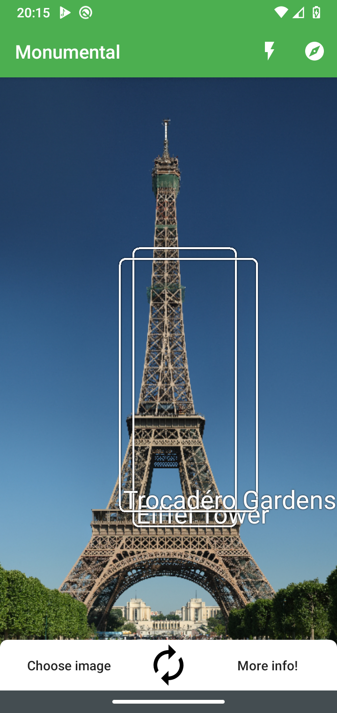
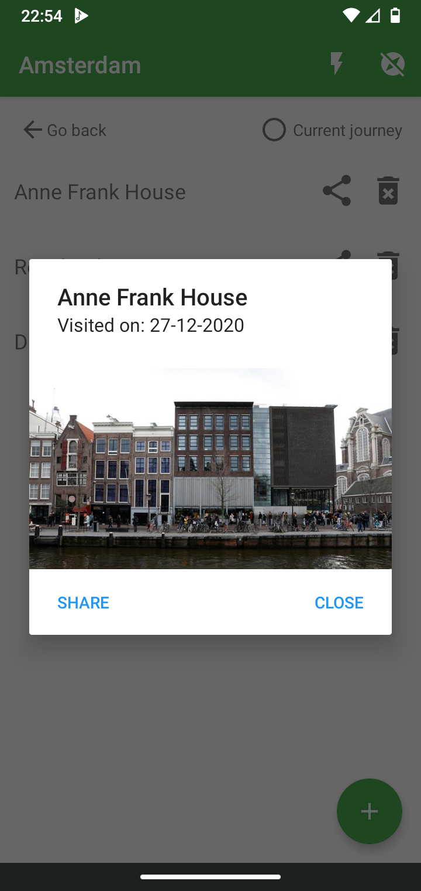
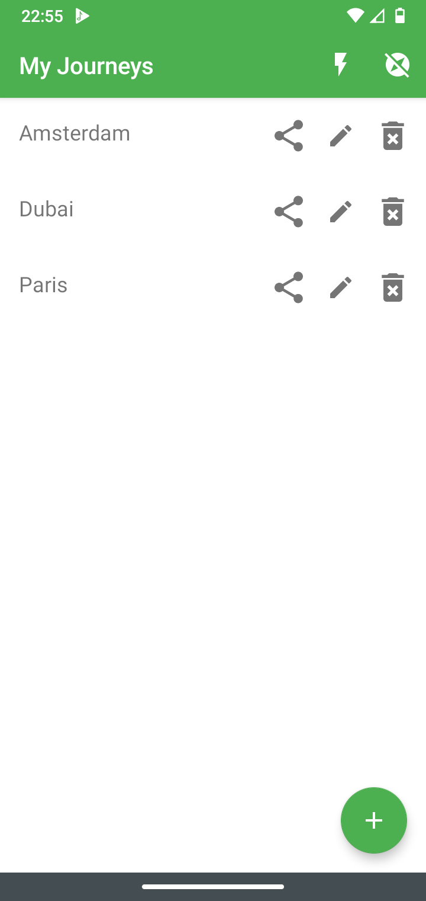

# Monumental - Android


---

## Technologies & Frameworks

- Android Framework [](https://developer.android.com/)
- Kotlin programming language [](https://kotlinlang.org/)
- Firebase [](https://firebase.google.com/)

---

## Features

More and more people go on far away ventures to foreign countries to see the world.
Traveling is expensive, and a lot to organize, because of that many people travel without a
dedicated guide to show them around and give information about the local landmarks
wherever they might be visiting. The vision for the Monumental Android application is to give
tourists anywhere in the world that travel without a guide the ability to get information about
landmarks by taking a picture of it. Next to that they will be able to keep track of what
landmarks they have visited and add them to their journey so that they are able to later look
back on all the landmarks they have visited.

Within the application a user will be able to take a picture using a live camera preview or
choose an existing picture from the phone’s storage. When a picture is taken or chosen the
application immediately gives a response if one or more landmarks have been detected
within the image. If one or more landmarks are detected in the image the application allows
the user to see the names of the landmarks. Users also have the ability to gather more
information about the found landmark(s) by performing a search for it from within the
application.

Users are also able to create journeys. Pictures of landmarks they take can be added to their
journeys which they are able to reference again later. That way users can see their past
journeys and what landmarks they have visited there. When a landmark is opened the picture
taken in which the landmark was detected can be viewed again.


---

## Screens




<video class="flex" autoplay muted loop playsinline controls src="../projects/monumental/monumental_demo.mp4"></video>

---

## Techniques & Libraries

- [MVVM Architecture](https://developer.android.com/jetpack/guide)
- [Room Persistence Library](https://developer.android.com/training/data-storage/room)
- [Kotlin Coroutines](https://developer.android.com/kotlin/coroutines)
- [Kotlin Coroutines](https://developer.chrome.com/docs/android/custom-tabs/overview/)
- [Picasso Library](https://developer.chrome.com/docs/android/custom-tabs/overview/)
- [Glide Library](https://developer.chrome.com/docs/android/custom-tabs/overview/)
- [Firebase ML Kit Landmark Recognition](https://firebase.google.com/docs/ml-kit/recognize-landmarks)
- [PinchToZoom](https://github.com/martinwithaar/PinchToZoom)

---

<details>
  <summary>Code Snippets</summary>
<div>

```
  loadTypes = () => {
      Loader.showLoader();
      PokémonService.getTypes().then(json => {
      this.setState({jsonData: json});
      Loader.hideLoader();
    });
  }
```
</div>
</details>

---

## Check out the project

[<button> Github</button>](https://github.com/alianza/Monumental)
[<button>APK Download</button>](https://google.com/)
[<button>Technical Docs</button>](https://drive.google.com/file/d/162SAxWKRrIahK1M_R8Q7BtnR_OMhz13o/view?usp=sharing)

---
