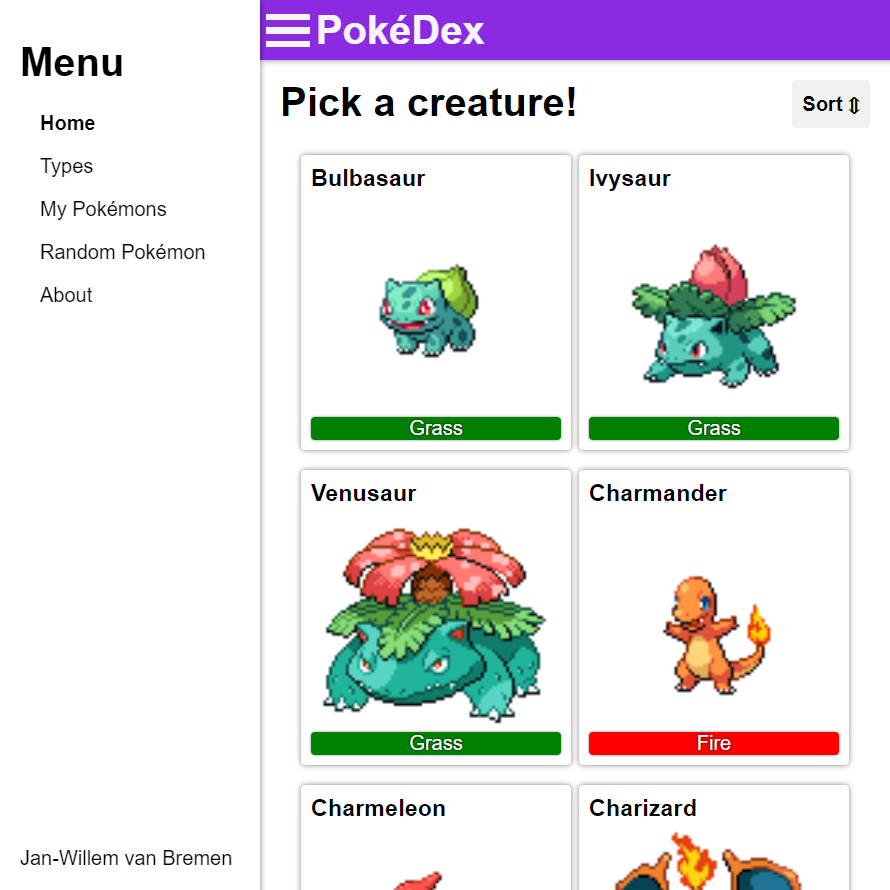

# PokéDex - Vue



As you know by now I like to experiment with the [*PokéApi*](https://pokeapi.co/). This project is the third Pokémon related application I have built.
This time built using the [*ReactJS*](https://reactjs.org/) web framework. This was my first ever *ReactJS* application I have created.
I have developed the application by myself over the span of a few days. After that I kept tweaking and adding some more features to it off and on for a couple more months.
The goal of this project was to teach myself the workings of the *ReactJS* framework.

---

## Technologies

- VueJS [](https://vuejs.org/)
- Vue-Router [](https://router.vuejs.org/)
- Sass [](https://sass-lang.com/)

---

## Features

The application features a sleek design that is very responsive. It boasts a slide in/out menu that floats over the UI on mobile devices.
The application allows you to brows through pages of Pokémons on the homepage. Also you are able to browse pokémons by type and see a random Pokémon from the API.
Every Pokémon can be opened and viewed in detail with its detail page. There the Pokémon's profile, types and statistics are displayed.
From here you are also able to view other Pokémons from the same type(s).
On top of that every Pokémon can be _'Caught'_ from the detail page which when you do this will show up in the _'My Pokémons'_ list.

The Application is fully routed so deeplinking to any page is supported. The UI is fully responsive and all css is writtes in Sass.
_'Caught'_ Pokémons are saved in local storage so loading is fast and persistent. All API endpoints have separated interfaces, so the architecture is loosely coupled.
The biggest file is for styling, and the largest component is 173 lines of code.

---

## Used Techniques

- [Fetch API](https://developer.mozilla.org/en-US/docs/Web/API/Fetch_API)
- [react-router-transition](https://github.com/maisano/react-router-transition)
- [NodeJS](https://nodejs.org/)

---

## Code Snippets

```
  loadTypes = () => {
      Loader.showLoader();
      PokémonService.getTypes().then(json => {
      this.setState({jsonData: json});
      Loader.hideLoader();
    });
  }
```
