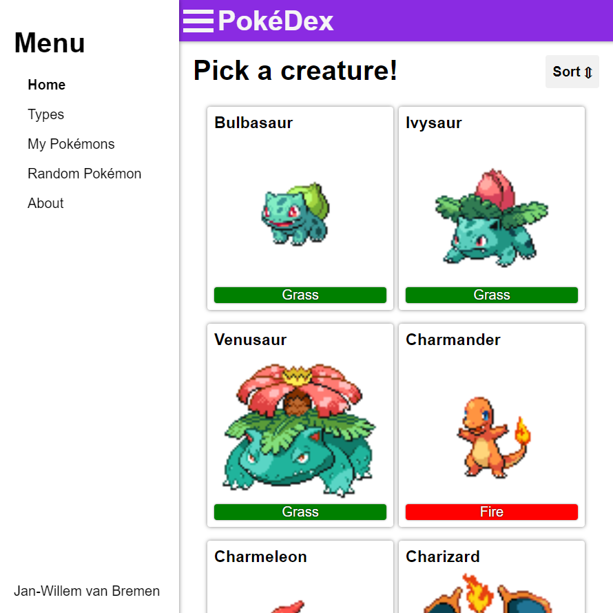

# PokéDex - React

As you know by now I like to experiment with the [*PokéApi*](https://pokeapi.co/). This project is the third Pokémon related application I have built. This time built using [*ReactJS*](https://reactjs.org/). This is my first every *ReactJS* application. I have developed the majority of the application by myself over the span of a few days. After that I kept tweaking it and adding some more features for a couple more months. The goal of this project was to teach myself the workings of the *ReactJS* framework.

## Technologies

- ReactJS 
- React-Router 
- Sass 

## Techniques
