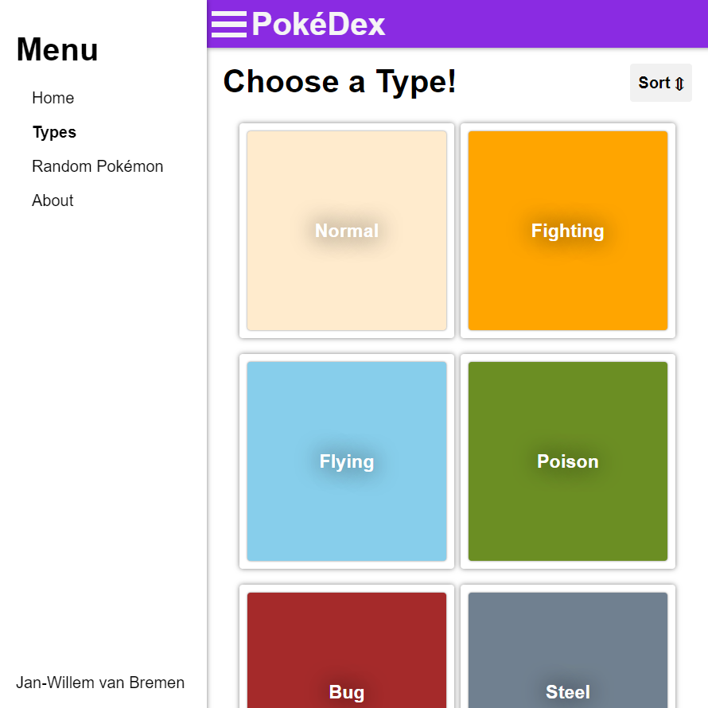

# PokéDex - Vue



As you know by now I like to experiment with the [*PokéApi*](https://pokeapi.co/). This project is the second Pokémon related application I have built.
This time built using the [*VueJS*](https://vuejs.org/) web framework. This was my first ever *VueJS* application I have created.
I have developed the application by myself over the span of a few days. After that I kept tweaking and adding some more features to it off and on for a couple more months.
The goal of this project was to teach myself the workings of the *VueJS* framework.

---

## Technologies & Frameworks

- VueJS [](https://vuejs.org/)
- Vue-Router [](https://router.vuejs.org/)
- Sass [](https://sass-lang.com/)
- Netlify [](https://netlify.com/)
- Progressive Web Application [](https://web.dev/progressive-web-apps/)

---

## Features

The application features a sleek design that is very responsive. It boasts a slide in/out menu that floats over the UI on mobile devices.
The application allows you to brows through pages of Pokémons on the homepage. Also you are able to browse pokémons by type and see a random Pokémon from the API.
Every Pokémon can be opened and viewed in detail with its detail page. There the Pokémon's profile, types and statistics are displayed.
From here you are also able to view other Pokémons from the same type(s).

The Application is fully routed so deeplinking to any page is supported. The UI is fully responsive and all css is written in Sass.
API endpoints have separated interfaces, so the architecture is loosely coupled. The biggest file is for styling, and the largest component is 173 lines of code.
The application is hosted using the [Netlify](https://netlify.com/) deployment platform.


---

## Screens


---

## Techniques & Libraries

- [Fetch API](https://developer.mozilla.org/en-US/docs/Web/API/Fetch_API)
- [Vue-fragment](https://github.com/Thunberg087/vue-fragment)
- [NodeJS](https://nodejs.org/)
- [JSON](https://json.org/)

---

<details>
<summary>Code Snippets</summary>
<div>

The following are some code snippets of pieces of code I'm proud of from this project. The snippets demonstrate clean, concise and powerful code.

**Retrieving Pokémon types**\
Retrieving remote Pokémon types from the _PokéApi_ using the PokémonService interface and assigning it to the current state.
```
  loadTypes = () => {
      Loader.showLoader();
      PokémonService.getTypes().then(json => {
      this.setState({jsonData: json});
      Loader.hideLoader();
    });
  }
```

**Pokémon Service**\
Part of the Pokémon Service interface for retrieving data from the PokéAPI with for getting Pokémons, types and paged Pokémons.

```
const PokemonService = {
    baseUrl: "https://pokeapi.co/api/v2",
    basePageLimit: 20,
    totalNumberOfPokemon: 0,

    doLoad(url) { // Base method for doing http Get requests
        if (!url.includes(this.baseUrl)) { url = this.baseUrl + url; }

        return fetch(url).then(response => {
            if (response.status === 404) { return ''; }
            if (response.status === 200) { return response.json(); }})
            .then(data => {
                return data}).catch(e => { console.log('Error', e) });
    },

    getPokemons() {
        return this.doLoad('/pokemon').then(jsonData => { return jsonData; }).catch(e => { console.log('Error', e) });
    },

    getPagedPokemons(offset) {
        return this.doLoad(`/pokemon?offset=${offset}&limit=${this.basePageLimit}`).then(jsonData => { return jsonData; }).catch(e => { console.log('Error', e) });
    },

    getPokemon(pokemonName) {
        return this.doLoad(`/pokemon/${pokemonName}`).then(jsonData => { return jsonData; }).catch(e => { console.log('Error', e) });
    },

    getTypes() {
        return this.doLoad('/type/').then(jsonData => { return jsonData; }).catch(e => { console.log('Error', e) });
    },
}

export default PokemonService;
```

</div>
</details>

---

## Check out the project

[<button> Github</button>](https://github.com/alianza/pokedexvue)
[<button>Visit Site</button>](https://pokedexvue.jwvbremen.nl/)

---
