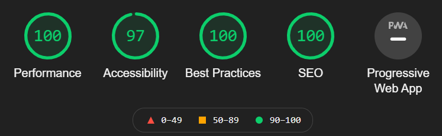

# Personal Portfolio Website - Vanilla JS


I built this Personal Portfolio Website to introduce myself as a software engineer, demonstrate some of my previous projects
and experiences and as practice in vanilla web development (No frameworks). I update this website with new content as I
make new projects or gain new professional experiences!

---

## Technologies & Frameworks

- Sass [](https://sass-lang.com/)
- Node.js [](https://www.nodejs.org/)
- Git(hub) [](https://www.github.com/)
- Netlify [](https://netlify.com/)
- Parcel.js [](https://parceljs.org/)

---

## Summary

The website features a lot of visual elements like a full screen background video, lots of images and hover effects.
Most of the website's content resides behind the clickable project images. In the dialog that pops up detailed information
for every project (That I've gotten around to write) can be found including images, video's, code snippets and links to source code
and live demo's. Content is created using Markdown and a minimal amount of HTML. This is all fetched on the fly when the user requests it.
The project is hosted using the [Netlify](https://netlify.com/) deployment platform.

---

## Screens


<video autoplay muted loop playsinline controls src="../projects/portfolio/portfolio.webm"></video>

## Lighthouse Audit Score 



---

<details>
  <summary>Code Snippets</summary>
<div>

The following are some code snippets of pieces of code I'm proud of from this project. The snippets demonstrate clean, concise and powerful code. _(Code has been compacted)_

**Main JavaScript file**\
The main JavaScript file is responsible for initializing the application, loading in dynamic data and responding to
user events. The file is written to be as straight forward and readable as possible while performing many essential functions
of the application.

```
function init() {
  document.getElementById('age').innerHTML = calculateYearsSinceDate(new Date('10-10-1998'))
  document.getElementById('years').innerHTML = calculateYearsSinceDate(new Date('1-7-2011'))

  window.addEventListener('scroll', () => onScroll() )
  window.addEventListener('resize', () => onResize() )
  window.addEventListener('keydown', e => escapeKeyListener(e) )
  window.addEventListener('popstate', e => openDialogFromPathname(e.path[0].location.pathname))

  onScroll()
  onResize()
  openDialogFromPathname(window.location.pathname)

  Object.entries(projects).forEach(([name, project], index) => { // Iterate through projects and append to dom
    document.querySelector('#experiences .wrapper').insertAdjacentHTML('beforeend',
  `<div class="col clickable ${index > 5 ? 'hidden' : ''}" onclick="onProjectClick(this.dataset.name)" data-name="${name}" data-team="${project.team}" data-tech="${project.tech}">
          
          <h3>${project.title}</h3>
        </div>`)
  });

  hljs.registerLanguage('javascript', javascript)
  hljs.registerLanguage('kotlin', kotlin)
}

function buildDialogContent (data) {
  const doc = document.createRange().createContextualFragment(data.toString()) // Create HTML fragment from HTML string
  doc.querySelectorAll('[alt]:not([alt=""])').forEach(e => { e.classList.add(e.getAttribute('alt').split(' ')[0]) }) // set classnames from first alt attribute value
  doc.querySelectorAll('img.flex').forEach( e => { e.parentElement.classList.add('flex') }) // Set flex attribute for flex images parent
  doc.querySelectorAll('details').forEach((e) => { new Accordion(e) }) // Set Accordion animation for all details tags
  doc.querySelectorAll('a').forEach((e) => { e.setAttribute('target', '_blank') }) // Open all links in new tabs
  constants.dialogContent.innerHTML = '' // Clear dialog
  constants.dialogContent.appendChild(doc) // Fill dialog with data
  document.querySelector('.dialog__content-wrapper').scrollTop = 0 // Scroll dialog to top
  hljs.highlightAll() // Highlight code blocks with Highlight.js
  collapseNavBar() // Force navBar to collapse (if at top of page scroll down first)
  constants.navBar.classList.remove('open') // Collapse mobile nav bar menu
  openDialog()
}

function getDialogContent(projectName) {
  showLoader()
  fetch(`/markdown/${projectName}.md`).then(response => response.text()).then(data => { // Get markdown for project
    data = marked(data) // Convert markdown to HTML
    if (!data.toString().includes('<!doctype html>')) { buildDialogContent(data) } // If successful
    else { getDialogContent('404') } // Else retrieve 404 page
  }).catch((error) => { console.error('Error:', error) })
}

function openDialog() {
  hideLoader();
  document.body.classList.add('scroll_disabled')
  constants.dialog.setAttribute('open', '')
}

function openDialogFromPathname(pathname) {
  let projectName = pathname.replace('/', '')
  if (pathname !== '/') { getDialogContent(projectName) } // If not on root page open dialog from path (projectName)
  else { closeDialog() }
}

window.openCV = () => { // Ask for language preference and open CV pdf blob
  if (confirm("Open English version?")) { getAndViewBlob(`/cv/Curriculum Vitae Jan-Willem van Bremen 500779265 - English.pdf`) }
  else if (confirm("Open Dutch version?")) { getAndViewBlob(`/cv/Curriculum Vitae Jan-Willem van Bremen 500779265.pdf`) }
}

window.onLogoClick = () => {
  window.history.pushState(null, null, window.location.origin)
  closeDialog()
  constants.navBar.classList.remove('open')
  window.scrollTo({ top: 0, behavior: 'smooth' })
}

window.handleMenuClick = (elem) => {
  const targetElem = document.getElementById(elem.dataset.linkTo)
  window.scrollTo({top: targetElem.offsetTop - constants.topOffsetSmall, behavior: 'smooth'})
  if (constants.dialog.hasAttribute('open')) { closeDialog() }
}

window.onMenuButtonClick = () => { constants.navBar.classList.toggle('open') }

window.closeDialog = () => {
  if (window.location.pathname !== '/') { window.history.pushState(null, null, window.location.origin) }
  document.body.classList.remove('scroll_disabled')
  constants.dialog.removeAttribute('open')
}

window.onProjectClick = (projectName) => {
  getDialogContent(projectName)
  if (!window.location.pathname.includes(projectName)) { window.history.pushState(null, projectName, '/' + projectName) }
}

init()
```

</div>
</details>

---

## Check out the project

[<button> Github</button>](https://github.com/alianza/portfolio)
[<button> Visit Site</button>](https://jwvbremen.nl/) _You are already here :)_
[<button> Lighthouse audit</button>](/projects/portfolio/lighthouse.html)

---
