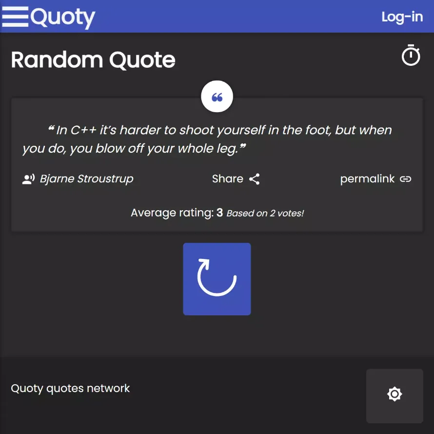
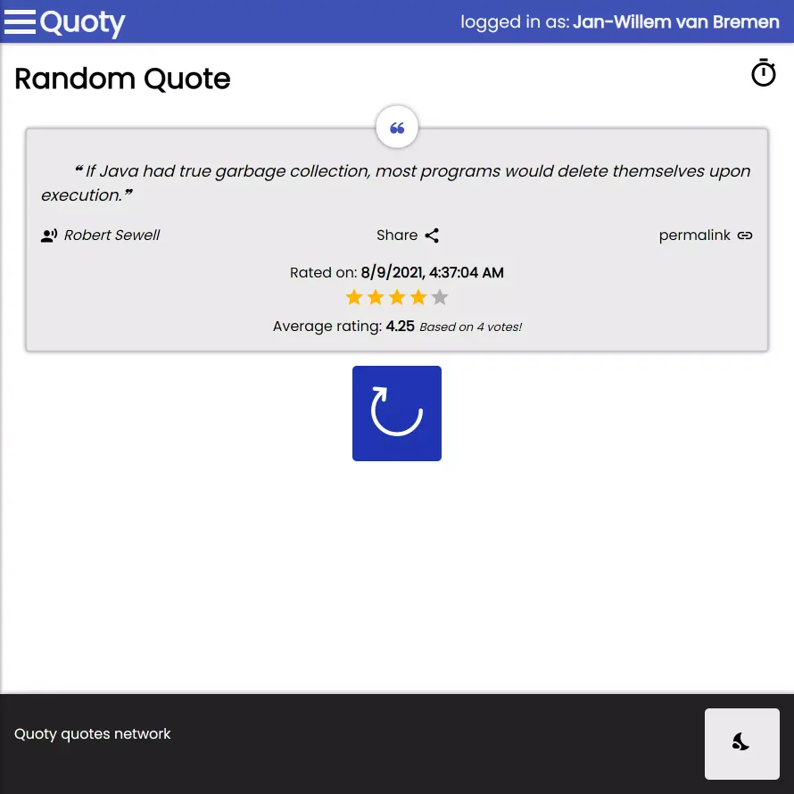

# Quoty Quotes Network - React



As you know by now I like to experiment with different API's.
This time built using the [*ReactJS*](https://reactjs.org/) web framework.
The application has been created for the coding assignment for the Kabisa company.
The goal of this project was to improve my understanding of the workings of the *ReactJS* framework.

---

## Technologies & Frameworks

- ReactJS [](https://reactjs.org/)
- React-Router [](https://reactrouter.com/)
- Sass [](https://sass-lang.com/)
- Node.js [](https://www.nodejs.org/)
- Git(hub) [](https://www.github.com/)
- Progressive Web Application [](https://web.dev/progressive-web-apps/)
- Google Firebase [](https://firebase.google.com/)
- Netlify [](https://netlify.com/)

---

## Summary

The Quoty Quotes Network is a Progressive Web Application and social network aimed at sharing ratings on different Quotes.
The Quotes are retrieved from the [*StormConsultancy Quotes API*](http://quotes.stormconsultancy.co.uk/). The application allows
anonymous users to view (random) Quotes and see the average ratings from other users on it. They are also able to share Quotes
on different social media platforms.

Users that log-in using an email and password combination or via their Google account gain the ability to rate Quotes based on stars.
Logged-in users can also view their account information and previously rated Quotes. The application also has the ability to
listen to the theme settings of the target device to decide what theme to show to the user. The application has both a light 
and dark theme.

The application is fully responsive and installable as a Progressive Web Application. The data storage and authentication
is done using [*Google Firebase*](https://firebase.google.com/) Authentication and the Realtime Database. The application is
hosted using the Netlify deployment platform.

---

## Screens





---

<details>
  <summary>Code Snippets</summary>
<div>

The following are some code snippets of pieces of code I'm proud of from this project. The snippets demonstrate clean, consice and powerful code. _(Code has been compacted)_

**App component**\
The App component is responsible for housing the application content, getting logged-in user information from Google Firebase
and showing the correct pages based on route. 

```
function App() {
    const [open, setOpenLogoutDialog] = useState(false)
    const [darkTheme, setDarkTheme] = useState(localStorageService.getValue(darkThemeKey))
    const [user, setUser] = useState()

    useEffect(() => { // Listen to the Firebase Auth state and set the local state.
        const unregisterAuthObserver = firebase.auth().onAuthStateChanged(user => { setUser(user) })
        return () => unregisterAuthObserver() // Make sure we un-register Firebase observers when the component unmounts.
    }, [])

    useTheme(darkTheme)

    useEventListeners()

    const toggleMenu = () => { document.getElementById("app").classList.toggle("menu-active") }

    const toggleTheme = () => { localStorageService.setKeyValue(darkThemeKey, !darkTheme); setDarkTheme(prevTheme => !prevTheme) }

    const logOut = () => {
        FirebaseService.logout().then(() => {
            setOpenLogoutDialog(true)
                setTimeout(() => {
                    setOpenLogoutDialog(false)
                }, 1500);
            }
        );
    }

    return (
        <Router>
            <div id="app">

                <Header user={user} onMenuClick={toggleMenu} title={'Quoty'}/>

                <Menu user={user} logOut={logOut} onMenuClick={toggleMenu}/>

                <div className={'content'}>
                    <Switch>
                        <Route exact path={['/']} render={({match}) =>
                            <Home user={user} match={match}/>}/>

                        <Route exact path={['/quote/:quoteId']} render={({match}) =>
                            <Quote user={user} match={match}/>}/>

                        <Route exact path={['/quotes']} render={({match}) =>
                            <MyQuotes user={user} match={match}/>}/>

                        <Route exact path={['/popular']} render={({match}) =>
                            <Popular user={user} match={match}/>}/>

                        <Route exact path={['/login', '/profile']} render={({match}) =>
                            <SignIn user={user} logOut={logOut} match={match}/>}/>

                        <Route render={() => <h1>404 Oops...</h1>}/>
                    </Switch>
                </div>

                <Footer darkTheme={darkTheme} onThemeButtonClick={toggleTheme}/>

                <Loader/>

                <Dialog open={open}>
                    <DialogTitle id="sign-out-dialog">Successfully Signed out!</DialogTitle>
                </Dialog>

            </div>
        </Router>
    );
}
```

**QuoteCard component**\
This code snippet demonstrates the QuoteCard component. It takes a Quote as props to present in the DOM towards the user.
The Quote card also facilitates functionality like sharing via social media, visiting the permalink of the quote, getting
information about the ratings on a particular quote and lastly when logged in rating a quote yourself.

```
function QuoteCard(props) {
    const [rating, setRating] = useState({ rating: 0, timestamp: null })
    const [averageRating, setAverageRating] = useState(0)
    const [numberOfRatings, setNumberOfRatings] = useState(0)
    const [anchorEl, setAnchorEl] = useState(null)
    const shareUrl = `https://${window.location.host}/quote/${props.quote.id}`

    const openShareMenu = (event) => { setAnchorEl(event.currentTarget) }

    const closeShareMenu = () => { setAnchorEl(null) }

    useEffect(() => { // Initial data fetch
        setRating(0) // Reset rating every time
        FirebaseService.getQuoteRatings(props.quote, props.user, setRating, setAverageRating, setNumberOfRatings)
    }, [props.quote, props?.user] )

    const createRating = (rating) => {
        setRating(rating)
        if (rating) { FirebaseService.addRating(rating, props.quote.id, props.user.uid) // Update rating
        } else { FirebaseService.removeRating(props.quote.id, props.user.uid) } // Remove rating
    }

    return (
        <blockquote className="quoteCard">
            <p className="quote">❝ {props.quote.quote}❞</p>
            <div className="info">
                <cite className="author">
                    <RecordVoiceOverIcon style={{marginRight: '6px'}} fontSize={"small"}/>{props.quote.author}
                </cite>
                <button className="link" onClick={openShareMenu}>Share<ShareIcon style={{marginLeft: '6px'}} fontSize={"small"}/></button>
                {props.match.path !== '/quote/:quoteId' && <NavLink to={`/quote/${props.quote.id}`}>permalink
                    <LinkIcon style={{marginLeft: '6px'}} fontSize={"small"}/>
                </NavLink>}
            </div>
                <div data-tip={!props.user ? 'Log in to vote!' : 'Your rating!'} className="rating tooltip">
                    {rating?.timestamp && <center className="ratingDate">Rated on: <b>{new Date(rating?.timestamp).toLocaleString(getLanguage())}</b></center>}
                    {!!props.user && <StarRating quoteId={props.quote.id} value={rating?.rating} onChange={(event, newValue) => { createRating(newValue) }}/>}
                    <div className="averageRating">Average rating: <span className="ratingValue">{Math.round(averageRating * 100) / 100 || 'Not yet rated'}</span>
                    {!!averageRating && <span className="ratingAmount">Based on {numberOfRatings} vote{numberOfRatings > 1 && 's'}!</span>}
                    </div>
                </div>
            <ShareMenu anchorEl={anchorEl} onClose={closeShareMenu} urlToShare={shareUrl} quote={props.quote}/>
        </blockquote>
    );
}
```

</div>
</details>

---

## Check out the project

[<button> Github</button>](https://github.com/alianza/quoty-quotes-network)
[<button> Visit Site</button>](https://quotes.jwvbremen.nl/)

---
