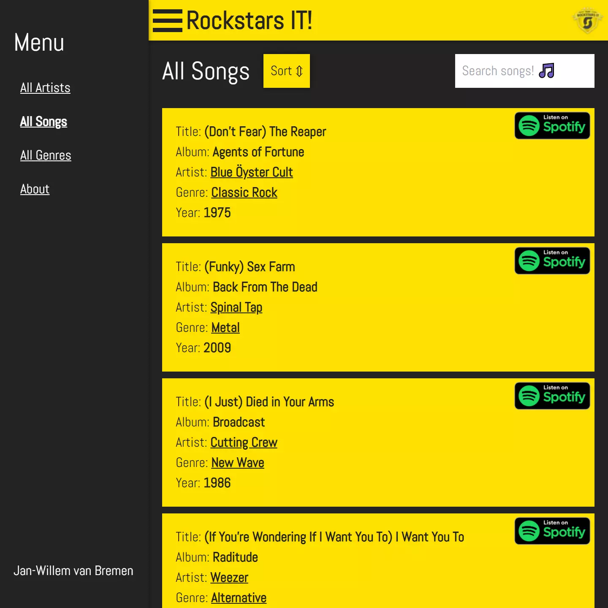
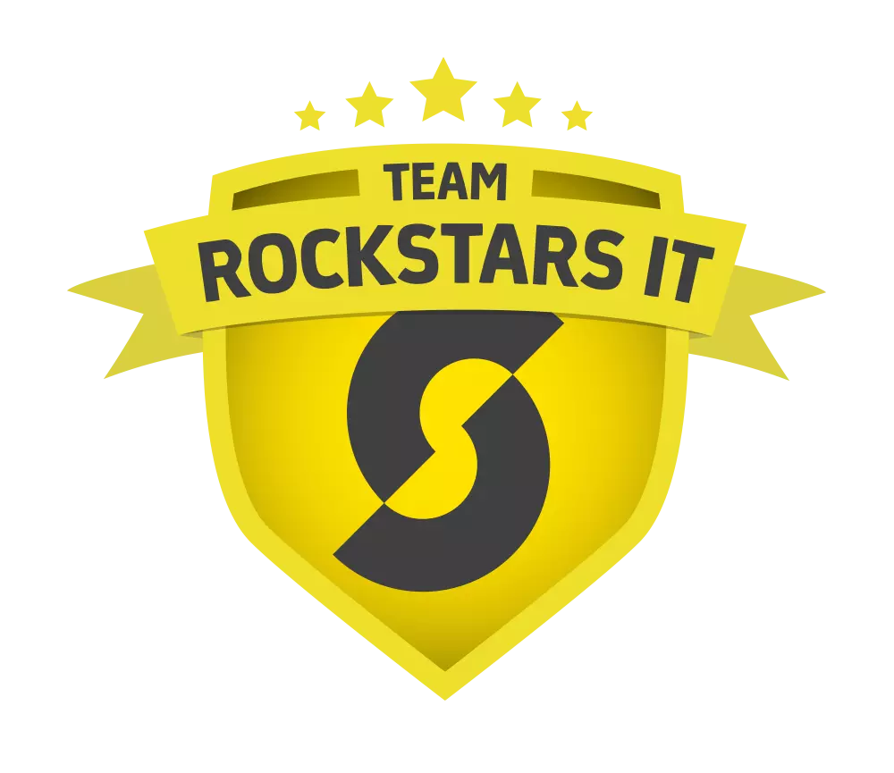
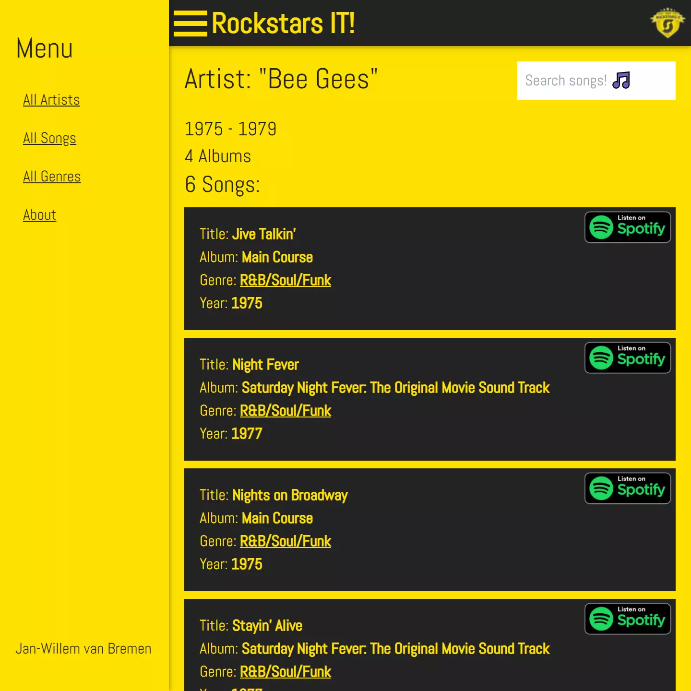
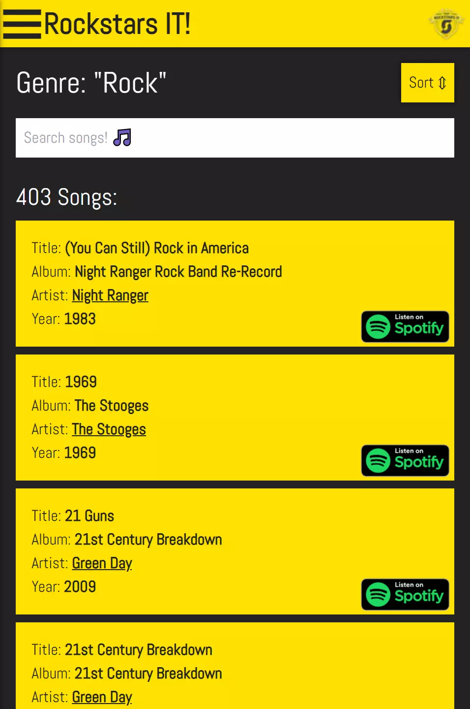
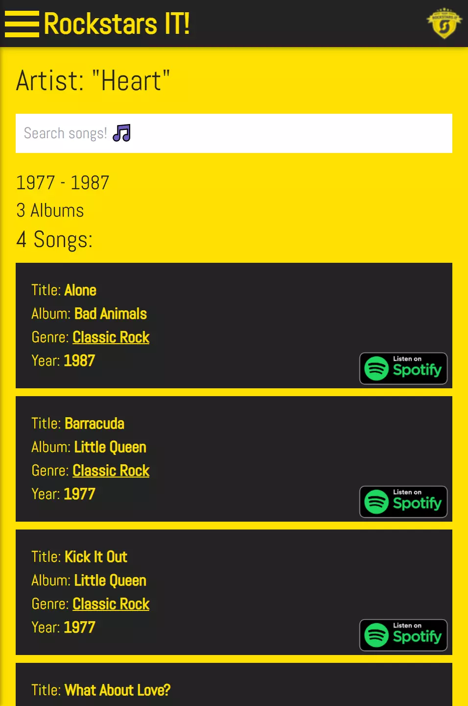

# Rockstars Static - Next.js



This project was a learning experience and a good example of how to use Next.js. This project demonstrates how to use 
Next.js to render static web pages from an external data source. The application allows you to search for rockstars and their songs.
The application is inspired by the Front-End Tech Case for my new position at Team Rockstars IT [](https://teamrockstars.nl/).

---

## Technologies & Frameworks

- Next.js Framework [](https://nextjs.org/)
- Sass [](https://sass-lang.com/)
- Node.js [](https://www.nodejs.org/)
- Git(hub) [](https://www.github.com/)
- Progressive Web Application [](https://web.dev/progressive-web-apps/)
- TailwindCSS [](https://tailwindcss.com/)
- Netlify [](https://netlify.com/)
- Vercel [](https://vercel.com/)

---

## Summary


---

## Screens







<video autoplay muted loop playsinline controls src="../projects/rockstars/rockstars.webm"></video>

---

<details>
  <summary>Code Snippets</summary>
<div>

The following are some code snippets of pieces of code I'm proud of from this project. The snippets demonstrate clean, concise and powerful code. _(Code has been compacted)_
The largest file in the project is 80 lines of code which says something about the simplicity of the code.

**App component**\
The App component is responsible for housing the application layout & content and showing the correct pages based on route.

```
function App() {
  return (
      <Router>
          <div id="app" className={'text-text-primary'}>

              <div id={'background'} className={'fixed w-full h-full bg-primary top-0'}/>

              <Menu/>

              <Wave id={'wave'} className={'fixed bottom-0 bg-primary transition-transform origin-bottom scale-x-450 scale-y-650 animate-waveSm xsm:scale-150 xsm:animate-waveXsm sm:scale-100 sm:animate-wave'}/>

              <AnimatedSwitch
                  atEnter={{opacity: 0}}
                  atLeave={{opacity: 0}}
                  atActive={{opacity: 1}}
                  className={'relative'}>

                  <Route exact path='/' component={Home}/>

                  <Route exact path={['/result', '/result/:name', '/result/:name/:countryCode']} component={Result}/>

                  <Route path="/about" component={About}/>

                  <Route component={NotFound}/>

              </AnimatedSwitch>

              <Loader/>

          </div>
      </Router>
  );
}
```

</div>
</details>

---

## Check out the project

[<button> Github</button>](https://github.com/alianza/rockstars_static)
[<button> Visit Site (Vercel)</button>](https://rockstars-static.vercel.app/)
[<button> Visit Site (Netlify)</button>](https://rockstars.jwvbremen.nl/)

---
