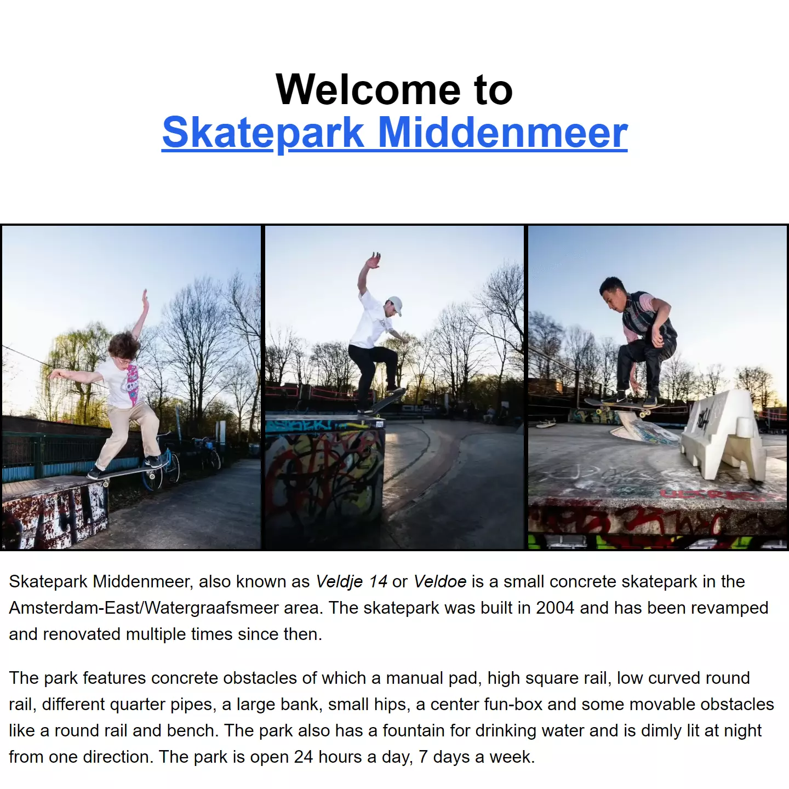
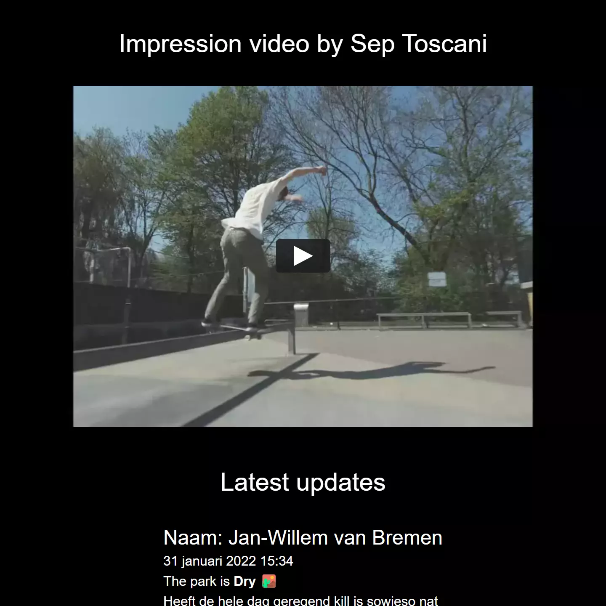
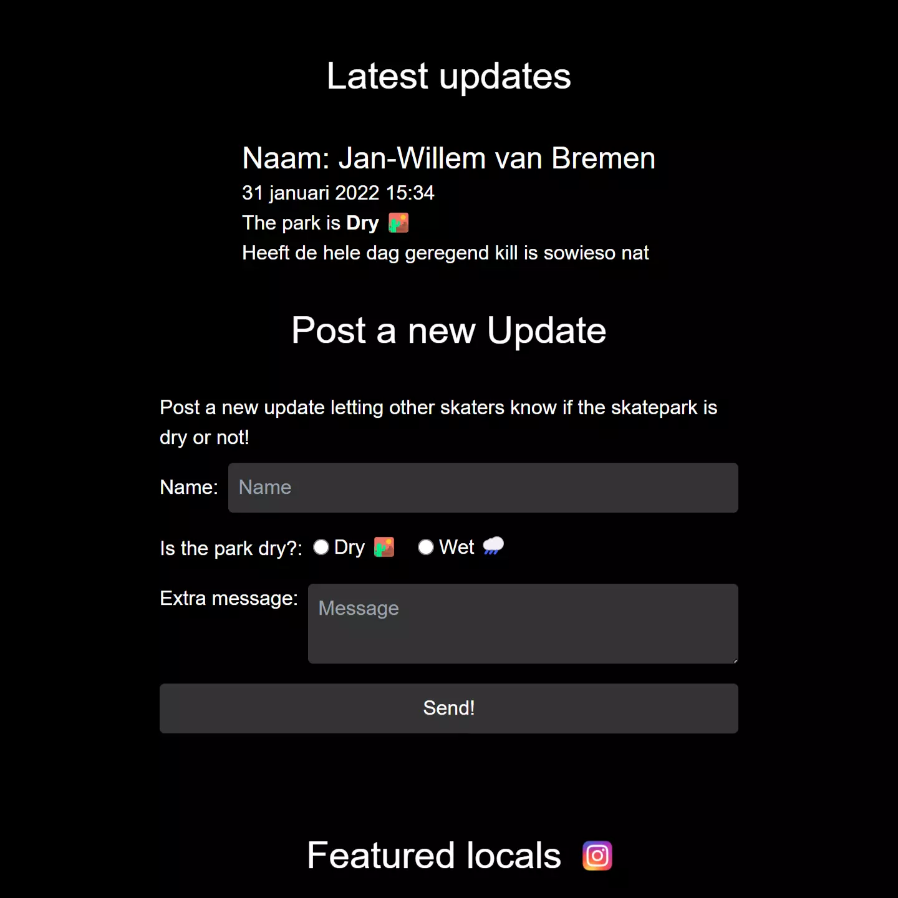
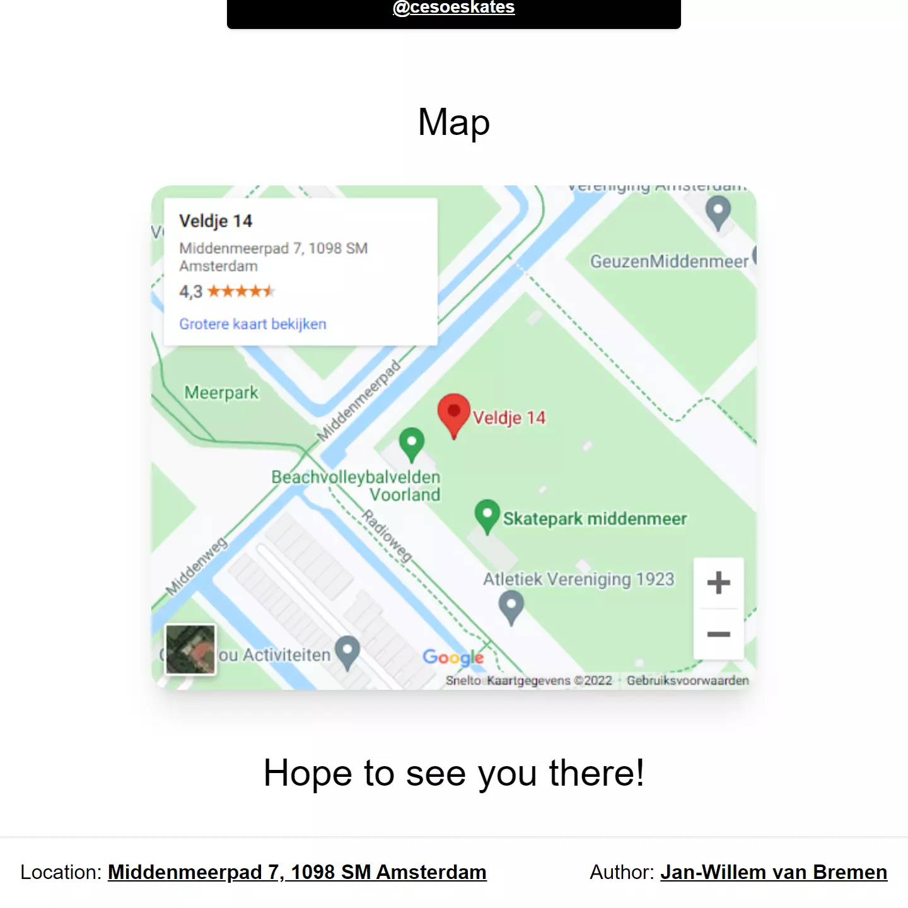
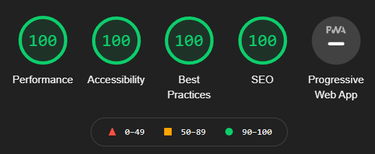

# Veldje14 Skatepark Website - Next.js



This website is an introduction and community website of the Veldje 14 skatepark in Amsterdam.
This project was a learning experience and example of how to use Next.js. This project demonstrates how to use 
Next.js to render static web pages from a local data source using markdown and JSON. It also loads dynamic
content from a remote API using _Google Firebase's_ realtime database for updates on the status of the skatepark.

---

## Technologies & Frameworks

- Next.js Framework [](https://nextjs.org/)
- Sass [](https://sass-lang.com/)
- Node.js [](https://www.nodejs.org/)
- Git(hub) [](https://www.github.com/)
- Google Firebase [](https://firebase.google.com/)
- TailwindCSS [](https://tailwindcss.com/)
- Netlify [](https://netlify.com/)
- Vercel [](https://vercel.com/)

---

## Summary

This website is statically generated from a local Markdown and JSON data source. The application is
built using Next.js and TailwindCSS version 3. The application allows users to gain information about the skatepark,
it's local skaters, the location and if it is currently dry or not. The application is extremely responsive and hosted
using the Vercel deployment platform.

---

## Screens






---

## Techniques & Libraries

- [NodeJS](https://nodejs.org/)
- [JSON](https://json.org/)
- [Fetch API](https://developer.mozilla.org/en-US/docs/Web/API/Fetch_API)
- [Yarn](https://yarnpkg.com/)
- [Cypress E2E testing](https://www.cypress.io/)
- [Github Actions](https://www.github.com/features/actions)
- [Lighthouse Audits](https://developers.google.com/web/tools/lighthouse/)
- [Prop-Types](https://www.npmjs.com/package/prop-types)

## Lighthouse Audit Score 



---

<details>
  <summary>Code Snippets</summary>
<div>

The following are some code snippets of pieces of code I'm proud of from this project. 
The snippets demonstrate clean, concise and powerful code following established best practices. _(Code has been compacted)_


**Index.js file with static rendering**\
The index.js file is the main page of the application. It gathers all the data from local files and renders the static site.

```
export async function getStaticProps() {

    const intro = await markdownToHtml(getLocalFile('intro.md'))

    const names = JSON.parse(getLocalFile('names.json'))

    const users = JSON.parse(getLocalFile('users.json'))

    return {
        props: {
            names,
            users,
            intro
        },
    }
}

export default function Home(props) {

    return (
        <Layout names={props.names}>

            <Images/>

            <Markdown markdown={props.intro}/>

            <Video/>

            <Updates/>

            <Users users={props.users}/>

            <Map/>

            <Message/>

        </Layout>
    )
}
```

**Updated component**\
The Updates component is a dynamic component that loads data from the remote Google Firebase API. It retrieves the 10 last
posted updates and displays them in a list to the user. It also shows a form to post a new update with. New Updates are
updated in realtime so new data is always available. The styling has mostly been done using TailwindCSS.

```
export default function Updates() {
  const [updates, setUpdates] = useState([])
  const [submitted, setSubmitted] = useState(false)

  useEffect(() => {
    onValue(getUpdatesRef(), snapshot => {
      setUpdates(snapshot.val())
    })
  }, [])

  const handleSubmit = e => {
    e.preventDefault()
    const formData = new FormData(e.target)
    e.target.reset()
    const update = {
      name: formData.get("name"),
      dry: formData.get("dry"),
      message: formData.get("message"),
      timestamp: Date.now()
    }
    pushUpdate(update)
    showSubmittedMessage()
  }

  const showSubmittedMessage = () => {
    setSubmitted(true)
    setTimeout(() => {
      setSubmitted(false)
      document.getElementById("latestUpdates").scrollIntoView({ behavior: "smooth" })
    }, 5000)
  }

  return(
    <section className={`${styles.section} ${styles.withPadding} w-full mobile:w-2/3 desktop:!w-1/2 my-12`}>
      <h1 id="latestUpdates" className={`${styles.title}`}>Latest updates</h1>

      <div className="flex flex-col gap-4 max-h-[480px] overflow-y-auto items-center">
        {
          updates ? Object.values(updates).reverse().map(update => (
            <div key={update.timestamp}>
              <h2>Naam: {update.name}</h2>
              <p>{getFormattedDate(new Date(update.timestamp))}</p>
              <p>The park is <b>{update.dry ? texts.dry : texts.wet}</b></p>
              <p>{update.message}</p>
            </div>
          )) : <span className="text-center">No Updates yet...</span>
        }
      </div>

      <div>
        <h1 className={`${styles.title}`}>Post a new Update</h1>
        <span className="block mb-2">Post a new update letting other skaters know if the skatepark is dry or not!</span>

      <form className="flex flex-col gap-4" onSubmit={handleSubmit}>
        <div className="flex items-center">
          <label className="mr-2" htmlFor="name">Name:</label>
          <input className="grow p-2 rounded bg-accent-2" id="name" type="text" placeholder="Name" name="name" required/>
        </div>
        <div className="flex items-center">
          <span className="mr-2" >Is the park dry?:</span>
          <fieldset className="inline-block">
            <div className="inline-flex flex-nowrap items-center">
              <input className="mr-1" id="dry" type="radio" name="dry" value="true" required/>
              <label className="mr-4" htmlFor="dry">{texts.dry}</label>
            </div>
            <div className="inline-flex flex-nowrap items-center">
              <input className="mr-1" id="wet" type="radio" name="dry" value="false" required/>
              <label htmlFor="wet">{texts.wet}</label>
            </div>
          </fieldset>
        </div>
        <div className="flex items-top">
          <label className="mr-2" htmlFor="message">Extra message:</label>
          <textarea className="grow p-2 rounded bg-accent-2" id="message" name="message" placeholder="Message"/>
        </div>
        {submitted && <span>Thank you for letting everybody know the status of the skatepark at the moment, your service is much appreciated!</span>}
        <button className="bg-accent-2 py-2 hover:bg-accent-1 transition transition-colors duration-250 rounded" type="submit">Send!</button>
      </form>
      </div>
    </section>
  )
}
```

</div>
</details>

---

## Check out the project

[<button> Github</button>](https://github.com/alianza/veldje14)
[<button> Visit Site</button>](https://veldje14.nl/)
[<button> Lighthouse audit</button>](/projects/veldje14/lighthouse.html)

---
